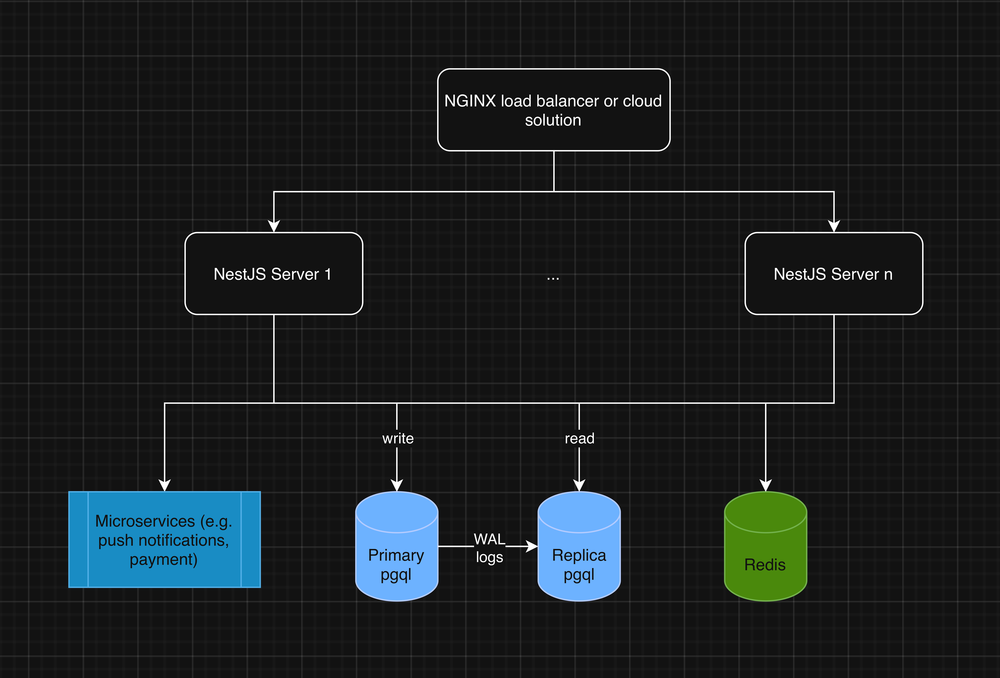

# infra-proposal

Below is a rough sketch of the overall architecture

## Load balancer

NGINX distributes incoming requests evenly across multiple API servers. It terminates SSL, manages load balancing, and monitors server health to avoid routing traffic to unhealthy instances. Alternatively, cloud-based load balancers, offered by AWS, Google Cloud, or Azure are feasible as well but are not self-managed and have subscription fees, the gain is that they require less manual config.

## API server in TypeScript with NestJS

The API layer is composed of multiple stateless NestJS servers written in TypeScript. Each server handles the same business logic described in the modules you provided. Stateless design allows horizontal scaling, while the modular NestJS architecture ensures code is maintainable and organised, adn that it aligns with the modular description you have given. These servers communicate with the database, Redis, and microservices as needed.

Rationale as to why TS and not Golang:
1. Enables type-sharing, improves productivity and reduces launch time
2. Go requires more manual scaffolding for complex APIs
3. Node.js async/await handles high concurrency efficiently for typical web workloads
4. Rich ecosystem + mature frameworks – NestJS provides DI, decorators, modularity, CLI tooling; large library support
5. The bottleneck lies not in the language in use but how database transactions are handled; while Go might provide a slight performance advantage it does not overweight the benefits of using TS if we manage to handle DB operations correctly.

## pgql database

The primary PostgreSQL database is responsible for handling all write operations. It maintains data integrity and transactional consistency using ACID properties. Every change is recorded in the WAL, which the replica then reads from to synchronise themselves with the primary.

The replica is in charge of read-heavy operations (read-only).

PostgreSQL is chosen over MySQL because it offers stronger support for transactional integrity and concurrency control. Concretely, it offers features such as 
1. native JSON support
2. robust ACID-compliant transactions
3. row-level locking
This aligns with the concurrency requirement.
Additionally, PostgreSQL’s streaming replication is in-built and makes easier to perform the replication.

## Redis db

Redis serves multiple purposes: caching frequently accessed data like provider availability, managing distributed locks to prevent double-booking, and acting as a message queue for asynchronous tasks, etc. This layer significantly reduces database load (SQL read write ops are much slower than redis). Also depending on how we implement authentication this might also come in handy.

## Notifcations worker

Notifications are triggered by events such as booking confirmations, cancellations, reminders, or promotional messages.
1. For mobile clients, FCM is used for Android devices, and APNs is used for iOS devices.
2. For web users, browser-based push notifications can be implemented using the Web Push API.

Notifications are processed asynchronously by background workers, which consume jobs from Redis queues to ensure that API servers remain responsive. This decouples notification delivery from the main request flow, which is more scalable. 

